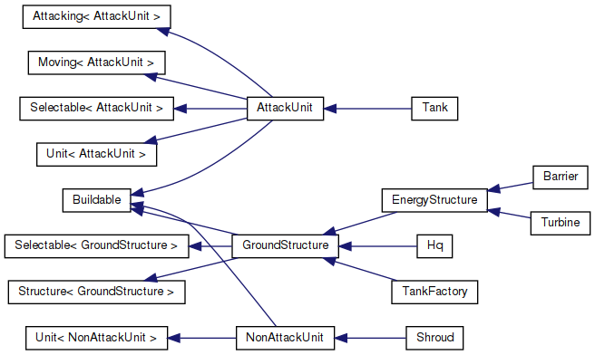
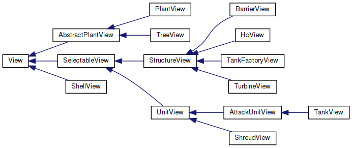

# Colony
This game is my attempt to create 3D strategy game. Initially, this repo contained all source files. But it quickly had been become apparent that 'engine' part should be separated somehow. So, that's how my homegrown 'engine' named 'fig' was born.

## Modules
For each module now there is the dedicated directory.
- assets: exported blender models, textures, etc. Used by: view.
- fig: homegrown engine. Used by: view.
- logic: gameplay logic like building units and structures. Use: view.
- shaders: vertex/fragment shaders defined using GLSL. Used by: view.
- view: definitions of how objects shold be renderes. Use: engine, shaders, assets. Used by: logic.

## Main class hierarchies
Updated list of diagrams generated by doxygen.
- Units and structures <br/>
- Views<br/>

## Codestyle
Defined by .clangformat. Vim setted up to autoformat code on every 'write' through vim-clang-format plugin.

## Documentation
Classed have to be documented. Right now doxygen generates usefull class diagrams.

## Build
Cmake is used. 'compile_commands.json' is generated by adding '-DCMAKE_EXPORT_COMPILE_COMMANDS=ON' and used by youcompleteme vim plugin. Tested only in Linux(Ubuntu 18.04, 5.3.0-26-generic). gcc: 7.4.0. Dependencies: OpenGL, GLFW, Assimp, GLEW. Sample commands:
```sh
// clone and create makefile
git clone https://github.com/ardazishvili/colony.git --recursive
mkdir fig/cbuild && cd fig/cbuild
cmake -DCMAKE_BUILD_TYPE=Debug -DCMAKE_EXPORT_COMPILE_COMMANDS=ON ..
cd ../..

// build colony
mkdir cbuild && cd cbuild
cmake -DCMAKE_BUILD_TYPE=Debug -DCMAKE_EXPORT_COMPILE_COMMANDS=ON ..
make
./colony
```

## Screenshots
Please, see 'screenshots' directory.

## Videos
Please, see https://www.youtube.com/channel/UCOiOGWCMSnEZTnkkepQVdyA.

## TODO
2. Encapsulate 'view' module.
